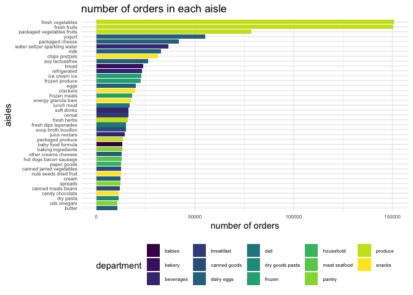

p8105\_hw3\_az2587
================
Anyu Zhu
10/12/2021

``` r
library(p8105.datasets)
library(tidyverse)
```

    ## ── Attaching packages ─────────────────────────────────────── tidyverse 1.3.1 ──

    ## ✓ ggplot2 3.3.3     ✓ purrr   0.3.4
    ## ✓ tibble  3.1.0     ✓ dplyr   1.0.5
    ## ✓ tidyr   1.1.3     ✓ stringr 1.4.0
    ## ✓ readr   1.4.0     ✓ forcats 0.5.1

    ## ── Conflicts ────────────────────────────────────────── tidyverse_conflicts() ──
    ## x dplyr::filter() masks stats::filter()
    ## x dplyr::lag()    masks stats::lag()

``` r
library(ggplot2)

theme_set(theme_minimal() + theme(legend.position = "bottom"))

options(
ggplot2.continuous.colour = "viridis",
ggplot2.continuous.fill = "viridis"
)

scale_colour_discrete = scale_colour_viridis_d
scale_fill_discrete = scale_fill_viridis_d
```

## Problem 1

``` r
data("instacart")
instacart %>% 
  janitor::clean_names()
```

    ## # A tibble: 1,384,617 x 15
    ##    order_id product_id add_to_cart_order reordered user_id eval_set order_number
    ##       <int>      <int>             <int>     <int>   <int> <chr>           <int>
    ##  1        1      49302                 1         1  112108 train               4
    ##  2        1      11109                 2         1  112108 train               4
    ##  3        1      10246                 3         0  112108 train               4
    ##  4        1      49683                 4         0  112108 train               4
    ##  5        1      43633                 5         1  112108 train               4
    ##  6        1      13176                 6         0  112108 train               4
    ##  7        1      47209                 7         0  112108 train               4
    ##  8        1      22035                 8         1  112108 train               4
    ##  9       36      39612                 1         0   79431 train              23
    ## 10       36      19660                 2         1   79431 train              23
    ## # … with 1,384,607 more rows, and 8 more variables: order_dow <int>,
    ## #   order_hour_of_day <int>, days_since_prior_order <int>, product_name <chr>,
    ## #   aisle_id <int>, department_id <int>, aisle <chr>, department <chr>

``` r
instacart %>% 
  distinct(aisle) 
```

    ## # A tibble: 134 x 1
    ##    aisle                        
    ##    <chr>                        
    ##  1 yogurt                       
    ##  2 other creams cheeses         
    ##  3 fresh vegetables             
    ##  4 canned meat seafood          
    ##  5 fresh fruits                 
    ##  6 packaged cheese              
    ##  7 specialty cheeses            
    ##  8 water seltzer sparkling water
    ##  9 cream                        
    ## 10 packaged vegetables fruits   
    ## # … with 124 more rows

There are **1384617** observations and **15** variables in the instacart
dataset. The variables are order\_id, product\_id, add\_to\_cart\_order,
reordered, user\_id, eval\_set, order\_number, order\_dow,
order\_hour\_of\_day, days\_since\_prior\_order, product\_name,
aisle\_id, department\_id, aisle, department.

Below are some specific questions related to the dataset：\\ How many
aisles are there, and which aisles are the most items ordered from?

``` r
aisle_ids = instacart %>% 
  distinct(aisle_id) 

aisle_best = instacart %>% 
  group_by(aisle_id) %>% 
  summarize(n_ordered = n()) %>% 
  mutate(aisle_rank = min_rank(desc(n_ordered))) %>% 
  filter(aisle_rank == 1)

aisle_best
```

    ## # A tibble: 1 x 3
    ##   aisle_id n_ordered aisle_rank
    ##      <int>     <int>      <int>
    ## 1       83    150609          1

There are in total **134** aisles. The id of the aisle where most items
are ordered from is **83**. \\

Make a plot that shows the number of items ordered in each aisle,
limiting this to aisles with more than 10000 items ordered. Arrange
aisles sensibly, and organize your plot so others can read it.

``` r
instacart %>% 
  group_by(aisle, department) %>% 
  summarize(n_ordered = n()) %>% 
  filter(n_ordered > 10000) %>% 
  #mutate(aisle = factor(aisle),
  #       aisle = fct_reorder(aisle, n_ordered)) %>% 
  ggplot(aes(x = reorder(aisle,n_ordered), y = n_ordered, fill = department)) + geom_col() + 
  labs(
    title = "number of orders in each aisle",
    x = "aisles",
    y = "number of orders"
  ) + 
  theme_minimal() +
  theme(axis.text.y = element_text(hjust = 1), 
        axis.text = element_text(size = 6),
        legend.position = "bottom",
        legend.text = element_text(size = 6)) + 
  coord_flip()
```

    ## `summarise()` has grouped output by 'aisle'. You can override using the `.groups` argument.

<!-- -->

Make a table showing the three most popular items in each of the aisles
“baking ingredients”, “dog food care”, and “packaged vegetables
fruits”. Include the number of times each item is ordered in your
table.

``` r
instacart %>% 
  filter(aisle == c("baking ingredients", "dog food care","packaged vegetables fruits")) %>% 
  group_by(aisle, product_name) %>% 
  summarize(n_times = n()) %>% 
  mutate(product_rank = min_rank(desc(n_times))) %>% 
  filter(product_rank == 1) %>% 
  select(-product_rank) %>% 
  knitr::kable()
```

    ## `summarise()` has grouped output by 'aisle'. You can override using the `.groups` argument.

| aisle                      | product\_name                                   | n\_times |
| :------------------------- | :---------------------------------------------- | -------: |
| baking ingredients         | Light Brown Sugar                               |      157 |
| dog food care              | Organix Grain Free Chicken & Vegetable Dog Food |       14 |
| packaged vegetables fruits | Organic Baby Spinach                            |     3324 |

Make a table showing the mean hour of the day at which Pink Lady Apples
and Coffee Ice Cream are ordered on each day of the week; format this
table for human readers (i.e. produce a 2 x 7 table).

``` r
instacart %>% 
  filter(product_name == c("Pink Lady Apples", "Coffee Ice Cream")) %>% 
  group_by(product_name, order_dow) %>% 
  summarize(mean_hour = round(mean(order_hour_of_day), digits = 2)) %>% 
  pivot_wider(names_from = order_dow, values_from = mean_hour) %>% 
  knitr::kable()
```

    ## Warning in product_name == c("Pink Lady Apples", "Coffee Ice Cream"): longer
    ## object length is not a multiple of shorter object length

    ## `summarise()` has grouped output by 'product_name'. You can override using the `.groups` argument.

| product\_name    |     0 |     1 |     2 |     3 |     4 |     5 |     6 |
| :--------------- | ----: | ----: | ----: | ----: | ----: | ----: | ----: |
| Coffee Ice Cream | 13.22 | 15.00 | 15.33 | 15.40 | 15.17 | 10.33 | 12.35 |
| Pink Lady Apples | 12.25 | 11.68 | 12.00 | 13.94 | 11.91 | 13.87 | 11.56 |
