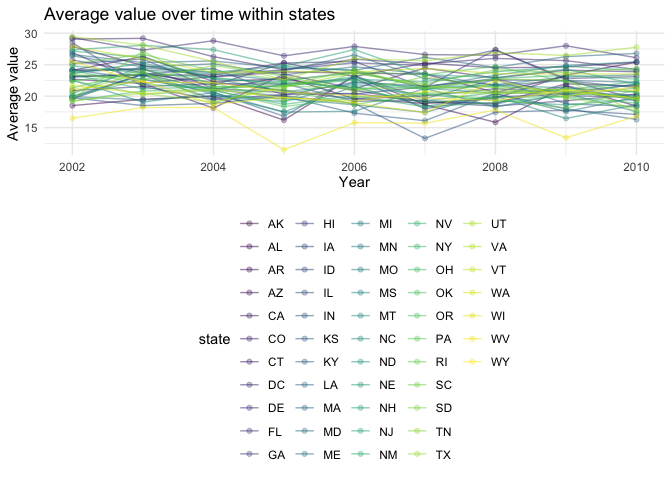
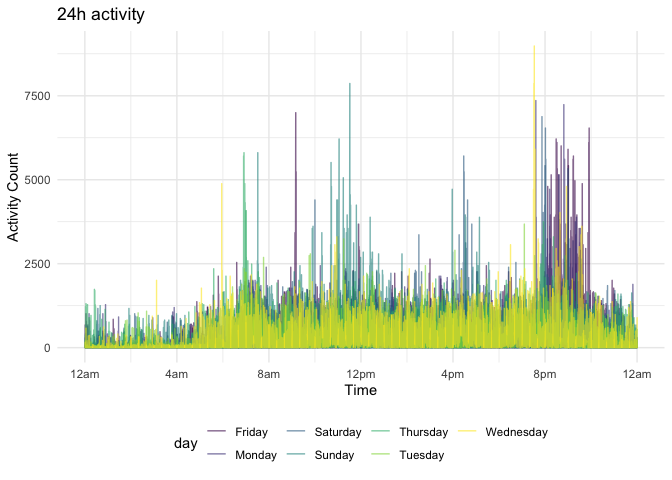

p8105\_hw3\_az2587
================
Anyu Zhu
10/12/2021

``` r
library(p8105.datasets)
library(tidyverse)
```

    ## ── Attaching packages ─────────────────────────────────────── tidyverse 1.3.1 ──

    ## ✓ ggplot2 3.3.3     ✓ purrr   0.3.4
    ## ✓ tibble  3.1.0     ✓ dplyr   1.0.5
    ## ✓ tidyr   1.1.3     ✓ stringr 1.4.0
    ## ✓ readr   1.4.0     ✓ forcats 0.5.1

    ## ── Conflicts ────────────────────────────────────────── tidyverse_conflicts() ──
    ## x dplyr::filter() masks stats::filter()
    ## x dplyr::lag()    masks stats::lag()

``` r
library(ggplot2)

theme_set(theme_minimal() + theme(legend.position = "bottom"))

options(
ggplot2.continuous.colour = "viridis",
ggplot2.continuous.fill = "viridis"
)

scale_colour_discrete = scale_colour_viridis_d
scale_fill_discrete = scale_fill_viridis_d
```

## Problem 1

``` r
data("instacart")
instacart %>% 
  janitor::clean_names()
```

    ## # A tibble: 1,384,617 x 15
    ##    order_id product_id add_to_cart_order reordered user_id eval_set order_number
    ##       <int>      <int>             <int>     <int>   <int> <chr>           <int>
    ##  1        1      49302                 1         1  112108 train               4
    ##  2        1      11109                 2         1  112108 train               4
    ##  3        1      10246                 3         0  112108 train               4
    ##  4        1      49683                 4         0  112108 train               4
    ##  5        1      43633                 5         1  112108 train               4
    ##  6        1      13176                 6         0  112108 train               4
    ##  7        1      47209                 7         0  112108 train               4
    ##  8        1      22035                 8         1  112108 train               4
    ##  9       36      39612                 1         0   79431 train              23
    ## 10       36      19660                 2         1   79431 train              23
    ## # … with 1,384,607 more rows, and 8 more variables: order_dow <int>,
    ## #   order_hour_of_day <int>, days_since_prior_order <int>, product_name <chr>,
    ## #   aisle_id <int>, department_id <int>, aisle <chr>, department <chr>

``` r
instacart %>% 
  distinct(aisle) 
```

    ## # A tibble: 134 x 1
    ##    aisle                        
    ##    <chr>                        
    ##  1 yogurt                       
    ##  2 other creams cheeses         
    ##  3 fresh vegetables             
    ##  4 canned meat seafood          
    ##  5 fresh fruits                 
    ##  6 packaged cheese              
    ##  7 specialty cheeses            
    ##  8 water seltzer sparkling water
    ##  9 cream                        
    ## 10 packaged vegetables fruits   
    ## # … with 124 more rows

There are **1384617** observations and **15** variables in the instacart
dataset. The variables are order\_id, product\_id, add\_to\_cart\_order,
reordered, user\_id, eval\_set, order\_number, order\_dow,
order\_hour\_of\_day, days\_since\_prior\_order, product\_name,
aisle\_id, department\_id, aisle, department. There are **21**
departments(including alcohol, bakery, beverages etc.). Among all
variables, order\_id, product\_id, add\_to\_cart\_order, reordered,
user\_id, order\_number, order\_dow, order\_hour\_of\_day,
days\_since\_prior\_order, aisle\_id, department\_id are integers while
the others are characters.

Below are some specific questions related to the dataset：\\ How many
aisles are there, and which aisles are the most items ordered from?

``` r
aisle_ids = instacart %>% 
  distinct(aisle_id) 

aisle_best = instacart %>% 
  group_by(aisle_id) %>% 
  summarize(n_ordered = n()) %>% 
  mutate(aisle_rank = min_rank(desc(n_ordered))) %>% 
  filter(aisle_rank == 1)

aisle_best
```

    ## # A tibble: 1 x 3
    ##   aisle_id n_ordered aisle_rank
    ##      <int>     <int>      <int>
    ## 1       83    150609          1

There are in total **134** aisles. The id of the aisle where most items
are ordered from is **83**.  

Make a plot that shows the number of items ordered in each aisle,
limiting this to aisles with more than 10000 items ordered. Arrange
aisles sensibly, and organize your plot so others can read it.

``` r
instacart %>% 
  group_by(aisle, department) %>% 
  summarize(n_ordered = n()) %>% 
  filter(n_ordered > 10000) %>% 
  ggplot(aes(x = reorder(aisle,n_ordered), y = n_ordered, fill = department)) + geom_col() + 
  labs(
    title = "number of orders in each aisle",
    x = "aisles",
    y = "number of orders"
  ) + 
  theme(axis.text.y = element_text(hjust = 1), 
        axis.text = element_text(size = 6),
        legend.text = element_text(size = 6)) + 
  coord_flip()
```

    ## `summarise()` has grouped output by 'aisle'. You can override using the `.groups` argument.

<!-- --> The
x axis of the plot denotes the number of orders while the y axis denotes
the corresponding aisle. Colors of the bars differ in department. We can
see that fresh vegetables are ordered the most frequently and butter is
ordered the least of times. The quantity of orders of fresh products and
dairy eggs are more than other kinds of products.

Make a table showing the three most popular items in each of the aisles
“baking ingredients”, “dog food care”, and “packaged vegetables
fruits”. Include the number of times each item is ordered in your
table.

``` r
instacart %>% 
  filter(aisle == c("baking ingredients", "dog food care","packaged vegetables fruits")) %>% 
  group_by(aisle, product_name) %>% 
  summarize(n_times = n()) %>% 
  mutate(product_rank = min_rank(desc(n_times))) %>% 
  filter(product_rank == 1) %>% 
  select(-product_rank) %>% 
  knitr::kable()
```

    ## `summarise()` has grouped output by 'aisle'. You can override using the `.groups` argument.

| aisle                      | product\_name                                   | n\_times |
| :------------------------- | :---------------------------------------------- | -------: |
| baking ingredients         | Light Brown Sugar                               |      157 |
| dog food care              | Organix Grain Free Chicken & Vegetable Dog Food |       14 |
| packaged vegetables fruits | Organic Baby Spinach                            |     3324 |

Make a table showing the mean hour of the day at which Pink Lady Apples
and Coffee Ice Cream are ordered on each day of the week; format this
table for human readers (i.e. produce a 2 x 7 table).

``` r
instacart %>% 
  filter(product_name %in% c("Pink Lady Apples", "Coffee Ice Cream")) %>% 
  group_by(product_name, order_dow) %>% 
  summarize(mean_hour = round(mean(order_hour_of_day), digits = 2)) %>% 
  pivot_wider(names_from = order_dow, values_from = mean_hour) %>% 
  rename("Sun" = `0`, 
         "Mon" = `1`,
         "Tue" = `2`,
         "Wed" = `3`,
         "Thu" = `4`,
         "Fri" = `5`,
         "Sat" = `6`) %>% 
  knitr::kable()
```

    ## `summarise()` has grouped output by 'product_name'. You can override using the `.groups` argument.

| product\_name    |   Sun |   Mon |   Tue |   Wed |   Thu |   Fri |   Sat |
| :--------------- | ----: | ----: | ----: | ----: | ----: | ----: | ----: |
| Coffee Ice Cream | 13.77 | 14.32 | 15.38 | 15.32 | 15.22 | 12.26 | 13.83 |
| Pink Lady Apples | 13.44 | 11.36 | 11.70 | 14.25 | 11.55 | 12.78 | 11.94 |

## Problem 2

Data preparation:

``` r
data("brfss_smart2010")
brfss = brfss_smart2010 %>% 
  janitor::clean_names() %>% 
  filter(topic == "Overall Health") %>% 
  mutate(
    response_rank = recode(response, `Poor` = 0, `Fair` = 1, `Good` = 2, `Very good` = 3,
                           `Excellent` = 4),
    response = fct_reorder(response, response_rank)) %>% 
  rename(state = locationabbr,
         location_description = locationdesc)

brfss
```

    ## # A tibble: 10,625 x 24
    ##     year state location_descrip… class   topic  question    response sample_size
    ##    <int> <chr> <chr>             <chr>   <chr>  <chr>       <fct>          <int>
    ##  1  2010 AL    AL - Jefferson C… Health… Overa… How is you… Excelle…          94
    ##  2  2010 AL    AL - Jefferson C… Health… Overa… How is you… Very go…         148
    ##  3  2010 AL    AL - Jefferson C… Health… Overa… How is you… Good             208
    ##  4  2010 AL    AL - Jefferson C… Health… Overa… How is you… Fair             107
    ##  5  2010 AL    AL - Jefferson C… Health… Overa… How is you… Poor              45
    ##  6  2010 AL    AL - Mobile Coun… Health… Overa… How is you… Excelle…          91
    ##  7  2010 AL    AL - Mobile Coun… Health… Overa… How is you… Very go…         177
    ##  8  2010 AL    AL - Mobile Coun… Health… Overa… How is you… Good             224
    ##  9  2010 AL    AL - Mobile Coun… Health… Overa… How is you… Fair             120
    ## 10  2010 AL    AL - Mobile Coun… Health… Overa… How is you… Poor              66
    ## # … with 10,615 more rows, and 16 more variables: data_value <dbl>,
    ## #   confidence_limit_low <dbl>, confidence_limit_high <dbl>,
    ## #   display_order <int>, data_value_unit <chr>, data_value_type <chr>,
    ## #   data_value_footnote_symbol <chr>, data_value_footnote <chr>,
    ## #   data_source <chr>, class_id <chr>, topic_id <chr>, location_id <chr>,
    ## #   question_id <chr>, respid <chr>, geo_location <chr>, response_rank <dbl>

In 2002, which states were observed at 7 or more locations? What about
in 2010?

``` r
states_2002 = brfss %>% 
  filter(year == 2002) %>% 
  group_by(state) %>% 
  distinct(location_description) %>% 
  summarize(n_location_obs = n()) %>% 
  filter(n_location_obs >= 7)

states_2002
```

    ## # A tibble: 6 x 2
    ##   state n_location_obs
    ##   <chr>          <int>
    ## 1 CT                 7
    ## 2 FL                 7
    ## 3 MA                 8
    ## 4 NC                 7
    ## 5 NJ                 8
    ## 6 PA                10

The states that were observed at 7 or more locations are CT, FL, MA, NC,
NJ, PA.

``` r
states_2010 = brfss %>% 
  filter(year == 2010) %>% 
  group_by(state) %>% 
  distinct(location_description) %>% 
  summarize(n_location_obs = n()) %>% 
  filter(n_location_obs >= 7)

states_2010
```

    ## # A tibble: 14 x 2
    ##    state n_location_obs
    ##    <chr>          <int>
    ##  1 CA                12
    ##  2 CO                 7
    ##  3 FL                41
    ##  4 MA                 9
    ##  5 MD                12
    ##  6 NC                12
    ##  7 NE                10
    ##  8 NJ                19
    ##  9 NY                 9
    ## 10 OH                 8
    ## 11 PA                 7
    ## 12 SC                 7
    ## 13 TX                16
    ## 14 WA                10

The states that were observed at 7 or more locations are CA, CO, FL, MA,
MD, NC, NE, NJ, NY, OH, PA, SC, TX, WA.

Construct a dataset that is limited to Excellent responses, and
contains, year, state, and a variable that averages the data\_value
across locations within a state.

``` r
excellent_df = brfss %>% 
  filter(response == "Excellent") %>% 
  group_by(state, year) %>% 
  summarize(mean_data_value = mean(data_value, na.rm = TRUE))
```

    ## `summarise()` has grouped output by 'state'. You can override using the `.groups` argument.

``` r
excellent_df
```

    ## # A tibble: 443 x 3
    ## # Groups:   state [51]
    ##    state  year mean_data_value
    ##    <chr> <int>           <dbl>
    ##  1 AK     2002            27.9
    ##  2 AK     2003            24.8
    ##  3 AK     2004            23.0
    ##  4 AK     2005            23.8
    ##  5 AK     2007            23.5
    ##  6 AK     2008            20.6
    ##  7 AK     2009            23.2
    ##  8 AL     2002            18.5
    ##  9 AL     2003            19.5
    ## 10 AL     2004            20  
    ## # … with 433 more rows

Make a “spaghetti” plot of this average value over time within a state.

``` r
excellent_df %>% 
  ggplot(aes(x = year, y = mean_data_value, color = state)) +
  geom_point(alpha = 0.3) +
  geom_line(aes(group = state), alpha = 0.5) +
  labs(title = "Average value over time within states",
       x = "Year",
       y = "Average value")
```

<!-- -->
The plot shows the changes of average values of each state over time.
The values drop slightly overall.

Make a two-panel plot showing, for the years 2006, and 2010,
distribution of data\_value for responses (“Poor” to “Excellent”) among
locations in NY State.

``` r
brfss %>% 
  group_by(year, state) %>% 
  filter((year == 2006 | year == 2010),
         state == "NY")%>% 
  ggplot(aes(x = response, y = data_value)) +
  geom_boxplot() +
  facet_grid(. ~ year)
```

<!-- -->

## Problem 3

``` r
accel = read_csv("accel_data.csv") %>% 
  janitor::clean_names() %>% 
  mutate(weekday_vs_weekend = recode(day, 
                                     `Saturday` = "weekend",
                                     `Sunday` = "weekend",
                                     `Monday` = "weekday",
                                     `Tuesday` = "weekday",
                                     `Wednesday` = "weekday",
                                     `Thursday` = "weekday",
                                     `Friday` = "weekday")) %>% 
  select(day_id, week, day, weekday_vs_weekend, everything()) %>% 
  pivot_longer(
    activity_1 : activity_1440,
    names_to = "activity",
    names_prefix = "activity_",
    values_to = "activity_count"
  ) %>% 
  rename(minute = activity) %>% 
  mutate(minute = as.numeric(minute))
```

    ## 
    ## ── Column specification ────────────────────────────────────────────────────────
    ## cols(
    ##   .default = col_double(),
    ##   day = col_character()
    ## )
    ## ℹ Use `spec()` for the full column specifications.

Aggregate across minutes to create a total activity variable for each
day, and create a table showing these totals:

``` r
accel %>% 
  group_by(day_id, week, day) %>% 
  summarize(total = sum(activity_count)) %>% 
  knitr::kable()
```

    ## `summarise()` has grouped output by 'day_id', 'week'. You can override using the `.groups` argument.

| day\_id | week | day       |     total |
| ------: | ---: | :-------- | --------: |
|       1 |    1 | Friday    | 480542.62 |
|       2 |    1 | Monday    |  78828.07 |
|       3 |    1 | Saturday  | 376254.00 |
|       4 |    1 | Sunday    | 631105.00 |
|       5 |    1 | Thursday  | 355923.64 |
|       6 |    1 | Tuesday   | 307094.24 |
|       7 |    1 | Wednesday | 340115.01 |
|       8 |    2 | Friday    | 568839.00 |
|       9 |    2 | Monday    | 295431.00 |
|      10 |    2 | Saturday  | 607175.00 |
|      11 |    2 | Sunday    | 422018.00 |
|      12 |    2 | Thursday  | 474048.00 |
|      13 |    2 | Tuesday   | 423245.00 |
|      14 |    2 | Wednesday | 440962.00 |
|      15 |    3 | Friday    | 467420.00 |
|      16 |    3 | Monday    | 685910.00 |
|      17 |    3 | Saturday  | 382928.00 |
|      18 |    3 | Sunday    | 467052.00 |
|      19 |    3 | Thursday  | 371230.00 |
|      20 |    3 | Tuesday   | 381507.00 |
|      21 |    3 | Wednesday | 468869.00 |
|      22 |    4 | Friday    | 154049.00 |
|      23 |    4 | Monday    | 409450.00 |
|      24 |    4 | Saturday  |   1440.00 |
|      25 |    4 | Sunday    | 260617.00 |
|      26 |    4 | Thursday  | 340291.00 |
|      27 |    4 | Tuesday   | 319568.00 |
|      28 |    4 | Wednesday | 434460.00 |
|      29 |    5 | Friday    | 620860.00 |
|      30 |    5 | Monday    | 389080.00 |
|      31 |    5 | Saturday  |   1440.00 |
|      32 |    5 | Sunday    | 138421.00 |
|      33 |    5 | Thursday  | 549658.00 |
|      34 |    5 | Tuesday   | 367824.00 |
|      35 |    5 | Wednesday | 445366.00 |

Make a single-panel plot that shows the 24-hour activity time courses
for each day and use color to indicate day of the week:

``` r
accel %>% 
  ggplot(aes(x = minute, y = activity_count, color = day)) + 
  geom_line() +
  labs(
    title = "24h activity",
    x = "Time",
    y = "Activity Count"
  ) +
  scale_x_continuous(breaks = c(0, 240, 480, 720, 960, 1200, 1440), 
                   labels = c("12am", "4am", "8am", "12pm", "4pm", "8pm", "12am"),
                   limits = c(0, 1440))
```

<!-- -->
